# [VMware vSphere]

> **한 줄 요약**: vSphere는 vCenter, ESXi와 같은 소프트웨어를 전부 포함하고 있는 가상화 플랫폼. 

---

## 1. 개요

### 이 툴이 뭔가
vSphere란 가상화 플랫폼으로, ESXi와 vCenter로 구성되어 있다. ESXi란 VMware에서 개발한 Type1 hypervisor이다. vCenter는 ESXi 호스트들을 관리하는 중앙 관리자 역할을 한다.

vSphere를 사용하는 목적은 다수의 가상머신들을 통합된 운영환경으로 관리, 고가용성, CI/CD, 유연한 resource 분배, VM 과 컨테이너 동시 운영, 부가적으로 네트워크 인프라 관리 등이 있다.

### 어디서 만들었나
- **VMware / 프로젝트**: (구)VMware, (신)Broadcom
- **라이선스**: 자체 라이센스
- **공식 사이트**: https://www.vmware.com/products/cloud-infrastructure/vsphere

### 어떤 상황에서 쓰나
vSphere 특히 ESXi를 사용하는 이유
1. 물리 서버 한 대로 여러 VM 동시에 돌리기 위해.
2. 서버 하드웨어 자원 효율적으로 사용하기 위해.
3. 스냅샷 기능 사용하기 위해.
4. **네트워크 가상화.**
5. 성능

### 비슷한 플랫폼과 비교
| 플랫폼 | 특징 | 차이점 |
|----|------|--------|
| **[Proxmox VE]** | KVM + LXC 컨테이너 동시 지원, 웹 UI | ESXi보다 기능은 적지만 무료, 요즘 가장 인기있는 대안 |
| **[XCP-ng]** | XenServer 기반, 안정적 | Proxmox보다 덜 알려졌지만 기업용으로 충분 |
| **[Nutanix AHV ]** |HCI(하이퍼컨버지드) 특화 | 스토리지+컴퓨팅 통합 환경에 특화, 일반 서버 가상화보다 비쌈 |
| **vSphere (ESXi)** |엔터프라이즈 표준, 안정성 최고 | 기준 |

---

## 2. 핵심 기능
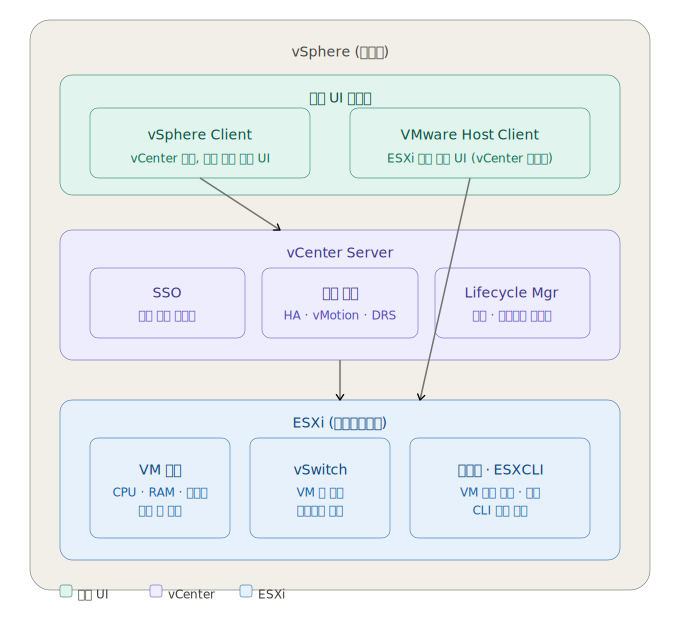

### 2.1 ESXi 핵심 기능
| 기능 | 설명 |
|------|------|
| Type 1 하이퍼바이저 | Windows/Linux 같은 OS 없이 하드웨어 위에 직접 설치되어 VM을 실행. VMware Workstation(Type 2)과 달리 중간 OS가 없어 성능 손실이 적음 |
| VM 실행 엔진 | 각 VM에 물리 CPU 코어, RAM 용량, 가상 디스크, 가상 NIC를 할당하고 독립된 환경으로 격리하여 실행 |
| vSwitch (가상 스위치) | 물리 스위치 없이 ESXi 내부에서 VM 간 통신 가능. 포트그룹으로 네트워크를 분리해 내부망/외부망 구분 가능 |
| 스냅샷 | VM의 디스크 상태 + 메모리 상태를 특정 시점에 저장. 실습 전 스냅샷 생성 후 문제 발생 시 해당 시점으로 즉시 롤백 가능 |
| ESXCLI | SSH 또는 직접 콘솔에서 `esxcli network`, `esxcli storage`, `esxcli system` 명령어로 ESXi 호스트를 CLI로 직접 제어 |

### 2.2 vCenter 핵심 기능
| 기능 | 설명 |
|------|------|
| 중앙 통합 관리 | 네트워크에 연결된 여러 ESXi 호스트를 하나의 콘솔에서 관리. ESXi 호스트별로 개별 접속할 필요 없이 vCenter 한 곳에서 모든 VM과 호스트를 조회·제어 가능 |
| HA (High Availability) | ESXi 호스트 한 대가 다운되면 해당 호스트의 VM들을 클러스터 내 다른 정상 호스트에서 자동으로 재시작. 서버 장애 시 수동 개입 없이 서비스 복구 |
| vMotion | 실행 중인 VM을 전원을 끄지 않고 다른 ESXi 호스트로 실시간 이동. 호스트 하드웨어 점검이나 업그레이드 시 VM 서비스를 유지한 채 작업 가능 |
| DRS (Distributed Resource Scheduler) | 클러스터 내 전체 호스트의 CPU·RAM 사용률을 실시간 모니터링. 특정 호스트에 부하가 집중되면 vMotion을 자동 실행해 VM을 여유 있는 호스트로 분산 |
| Lifecycle Manager | ESXi 호스트의 펌웨어·드라이버·패치를 중앙에서 일괄 배포. 원하는 ESXi 버전 이미지를 정의하면 클러스터 전체 호스트를 해당 상태로 자동 업데이트 |

### 2.3 vSphere Client 핵심 기능
| 기능 | 설명 |
|------|------|
| 웹 기반 관리 UI | 브라우저에서 vCenter 주소로 접속해 전체 vSphere 환경을 GUI로 관리. 별도 클라이언트 설치 불필요 |
| VM 생성 및 설정 | 마법사 UI로 VM 이름, OS 종류, CPU 코어 수, RAM 용량, 디스크 크기, 네트워크 어댑터를 설정하고 생성. ISO 파일 마운트 후 OS 설치 가능 |
| 네트워크 관리 | 표준 vSwitch 및 분산 vSwitch(dvSwitch) 생성, 포트그룹 추가, VLAN 설정을 GUI로 관리. VM별 네트워크 어댑터 연결 포트그룹 변경 가능 |
| 모니터링 | 각 호스트와 VM의 CPU 사용률, RAM 사용량, 네트워크 트래픽, 디스크 I/O를 실시간 그래프로 확인. 경고 임계값 설정 및 알림 구성 가능 |
| 권한 관리 | 사용자·그룹별로 역할(관리자, 읽기 전용 등)을 할당하는 RBAC 구성. 특정 VM이나 호스트에만 접근 권한을 부여하는 세분화된 권한 관리 가능 |

### 2.4 VMware Host Client 핵심 기능
| 기능 | 설명 |
|------|------|
| 단독 ESXi 관리 UI | vCenter 없이 `https://ESXi_IP` 로 브라우저 접속해 단일 ESXi 호스트를 직접 관리. 소규모 환경이나 vCenter 장애 시 대안으로 사용 |
| VM 생성 및 제어 | 새 VM 생성, ISO 마운트, 전원 켜기/끄기/재시작, VM 콘솔 창 직접 접속(원격 키보드·마우스 제어) 가능 |
| 스냅샷 관리 | VM별 스냅샷 생성, 목록 조회, 특정 스냅샷으로 복구(Revert), 불필요한 스냅샷 삭제를 GUI로 처리 |
| 네트워크 설정 | vSwitch 추가, 포트그룹 생성, 물리 NIC(vmnic) 연결, IP 및 VLAN 설정을 GUI로 구성 |
| 스토리지 관리 | 데이터스토어 용량 확인, VM 디스크 파일(.vmdk) 업로드/다운로드, ISO 파일 업로드 후 VM에 마운트 가능 |

### 2.5 vCenter Single Sign-On (SSO) 핵심 기능
| 기능 | 설명 |
|------|------|
| 통합 인증 | 한 번 로그인하면 SAML 토큰을 발급해 vSphere Client, vCenter, ESXi 등 모든 컴포넌트에 별도 로그인 없이 접근 가능 |
| 사용자 관리 | vsphere.local 도메인에 로컬 사용자 및 그룹을 생성하고 vSphere 환경 접근 권한을 부여 |
| Active Directory 연동 | 기업 내 AD 계정을 ID 소스로 등록해 직원들이 기존 회사 계정으로 vSphere에 로그인 가능 |

### 2.6 vSphere Lifecycle Manager 핵심 기능
| 기능 | 설명 |
|------|------|
| 패치 관리 | CVE 보안 패치, 버그픽스 업데이트를 Broadcom 저장소에서 내려받아 ESXi 호스트에 일괄 배포. 호스트를 유지보수 모드로 전환 후 자동 적용 |
| 이미지 기반 관리 | ESXi 버전·드라이버·VIB 구성을 "원하는 상태 이미지"로 정의하고, 클러스터 전체 호스트가 해당 이미지와 일치하는지 자동 점검 및 적용 |
| 업그레이드 자동화 | 여러 ESXi 호스트를 순차 또는 병렬로 업그레이드. vMotion으로 VM을 먼저 이동시킨 뒤 호스트를 업그레이드하는 방식으로 무중단 업그레이드 가능 |

---

## 3. 설치 방법

### 요구사항

#### 3.1 물리 서버에 직접 설치 (Bare-metal)
| 항목 | 최소 사양 | 권장 사양 |
|------|-----------|-----------|
| OS | 없음 (ESXi가 OS 역할) | 없음 |
| CPU | 64비트 멀티코어 x86, 2코어 이상 (Intel VT-x 또는 AMD-V 지원 필수) | Intel Xeon / AMD EPYC 4코어 이상 |
| RAM | 8GB | 12GB 이상 (VM 운영 시 32GB 권장) |
| 디스크 | 부트 디스크 32GB 이상 (HDD/SSD/NVMe) | 128GB 이상 SSD (ESX-OSData 최적화) |
| 네트워크 | 1Gbps 이상 NIC 1개 | 1Gbps 이상 NIC 2개 이상 (관리망/VM망 분리) |
| 기타 | BIOS에서 VT-x/AMD-V 활성화, UEFI 부팅 권장 | RAID 1 미러링 권장 (부트 디스크 이중화) |

#### 3.2 가상환경에 설치 (Nested Virtualization)
| 항목 | 최소 사양 | 권장 사양 |
|------|-----------|-----------|
| OS | VMware Workstation Pro 설치 가능한 Windows 10 / Linux | Windows 11 / Ubuntu 22.04 LTS |
| CPU | 64비트 멀티코어 x86, Intel VT-x 또는 AMD-V 지원 필수 | Intel Core i7 / AMD Ryzen 7 이상 |
| RAM | 16GB (호스트 OS + ESXi + 내부 VM) | 32GB 이상 |
| 디스크 | 200GB 이상 여유 공간 | 500GB 이상 SSD |
| 네트워크 | 가상 NIC 1개 | 가상 NIC 2개 이상 (내부망/외부망 분리) |
| 기타 | BIOS에서 VT-x/AMD-V 활성화, Workstation에서 "Virtualize Intel VT-x/EPT" 옵션 활성화 필수 | - |

> **참고**: 공식 요구사항 출처 — [ESXi Hardware Requirements](https://techdocs.broadcom.com/us/en/vmware-cis/vsphere/vsphere/8-0/esx-installation-and-setup/installing-and-setting-up-esxi-install/esxi-requirements-install/esxi-hardware-requirements-install.html)

### 설치 단계

**Step 1 — [Vmware vSphere Hypervisior (ESXi ISO) image 다운로드]**

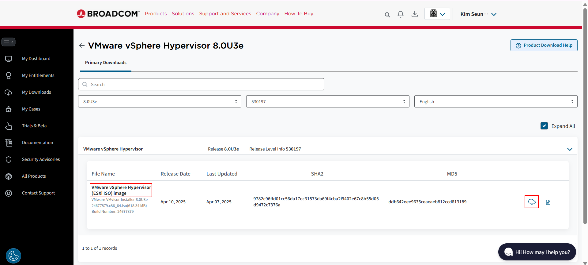

https://support.broadcom.com/group/ecx/productfiles?subFamily=VMware%20vSphere%20Hypervisor&displayGroup=VMware%20vSphere%20Hypervisor&release=8.0U3e&os=&servicePk=530197&language=EN&freeDownloads=true
해당 url을 통해 VMware-VMvisor-Installation-8.0U3e-24677879.x86_64.iso를 다운로드

**Step 2 — 가상 머신 생성**

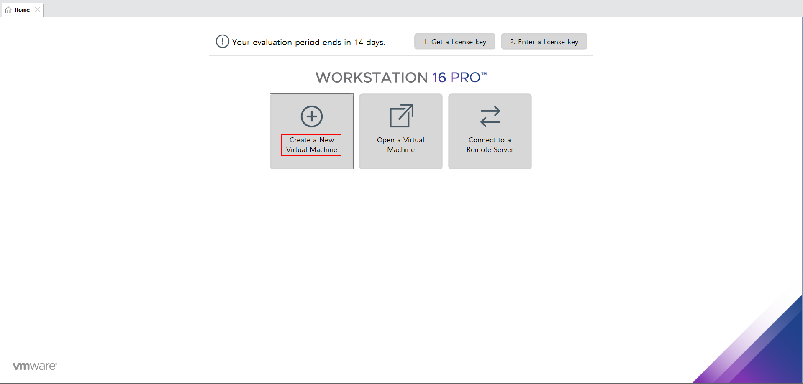

가상 머신 생성

**Step 3 — 설치 유형 선택**

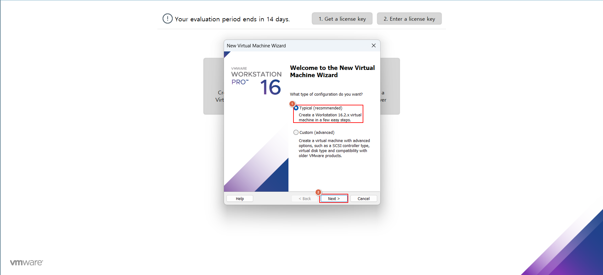

Typical 체크 후 Next 버튼 클릭

**Step 4 — ISO 이미지 선택**

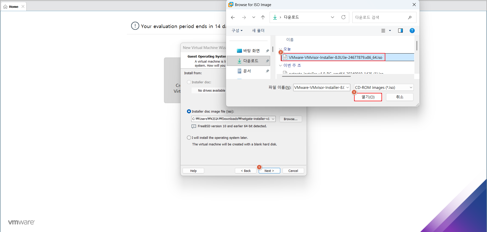

다운로드 받은 VMware-VMvisor-Installation-8.0U3e-24677879.x86_64.iso 선택 후 열기 버튼 클릭

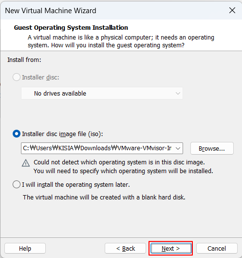

next 버튼 클릭

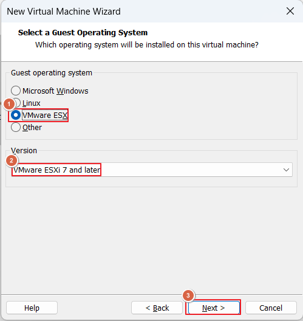

Guest operating system VMware ESX로 체크, VMware 17 프로의 경우 VMware ESXi 7 and later 그 이상의 버전은 VMware ESXi 8 and later 선택 후 next 버튼 클릭

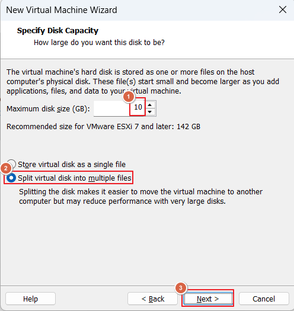

테스팅만 하는 경우는 disk size 10G 정도로만 설정하더라도 무방, virtual dis into multiple files로 설정하는것 추천

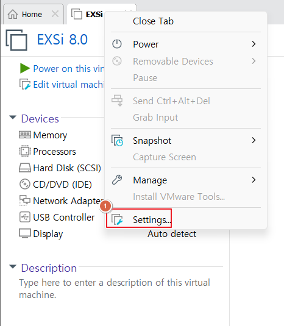

이후 해당 가상머신 탭 부근에서 우클릭 후 Settings 클릭

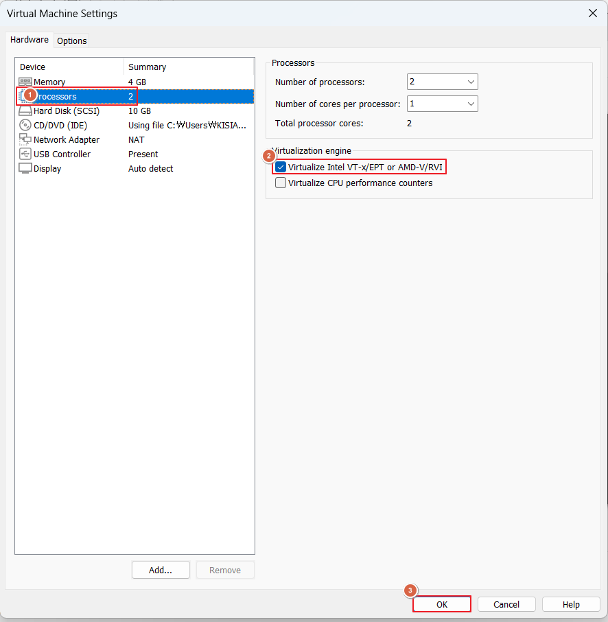

Processors에 Virtualization engine에서 Virtualize Intel VT-x/EPT or AMD-V/RVI 선택-> ok 버튼 클릭

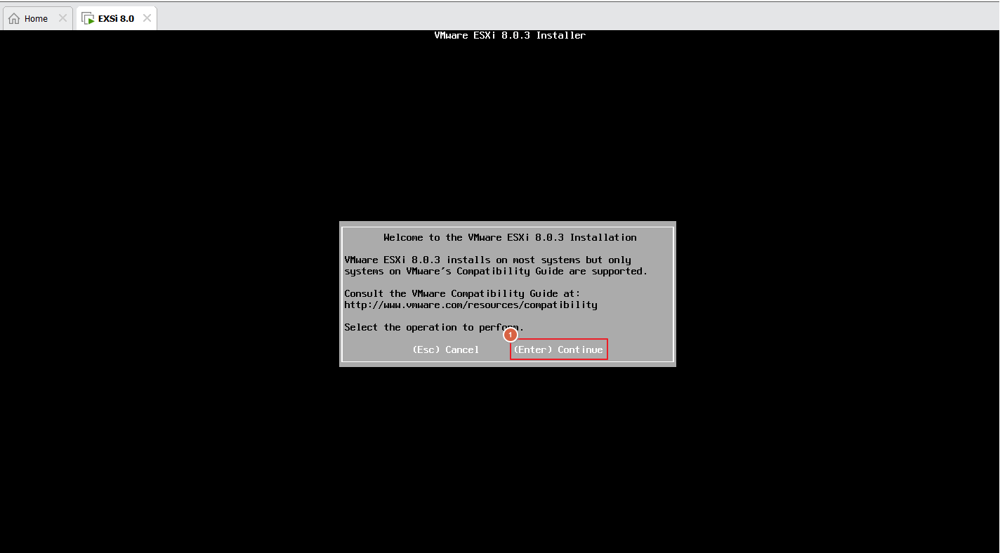

이후 가상머신 실행하면 위와 같은 화면들이 나온다. enter 누르기.

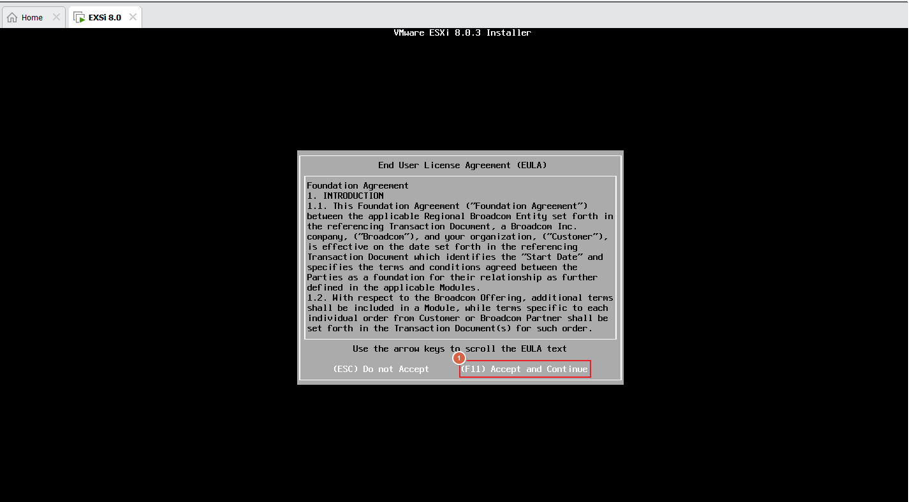

F11 누르기

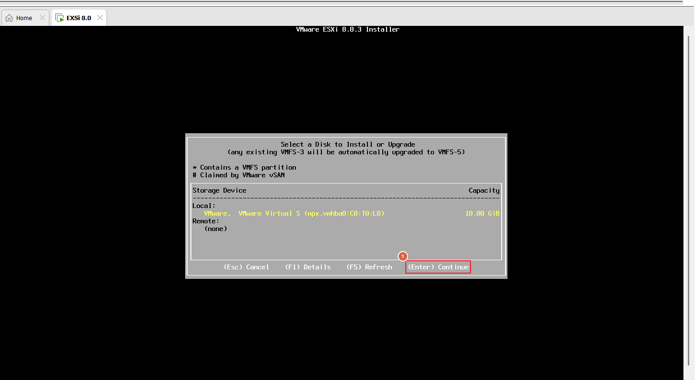

Enter 누르기

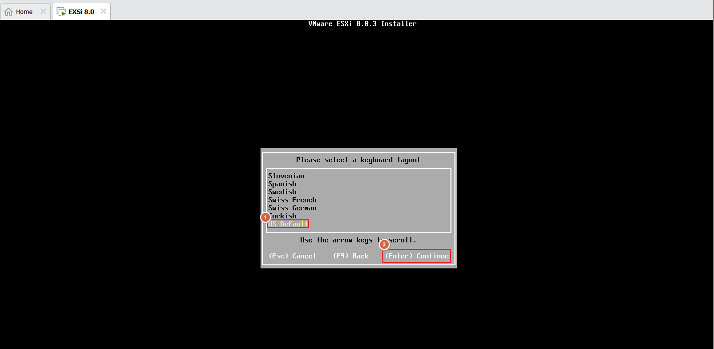

언어 설정 후 Enter 누르기

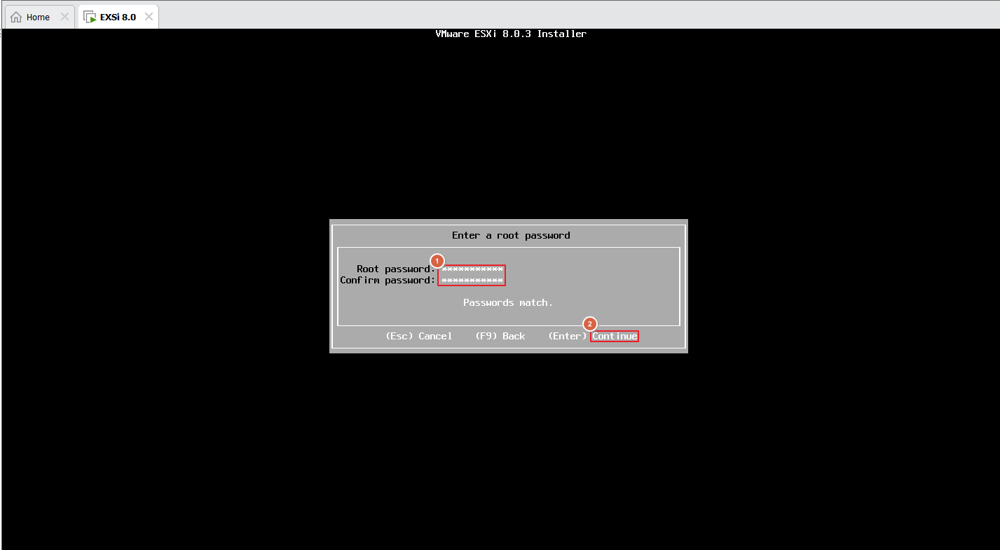

비밀번호 설정 후 Enter 누르기

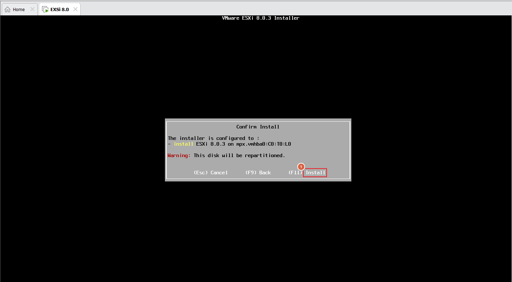

F11 누르기

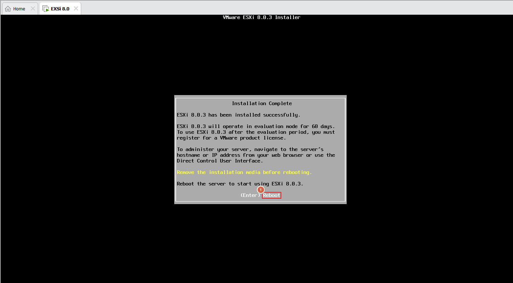

Enter 누르기

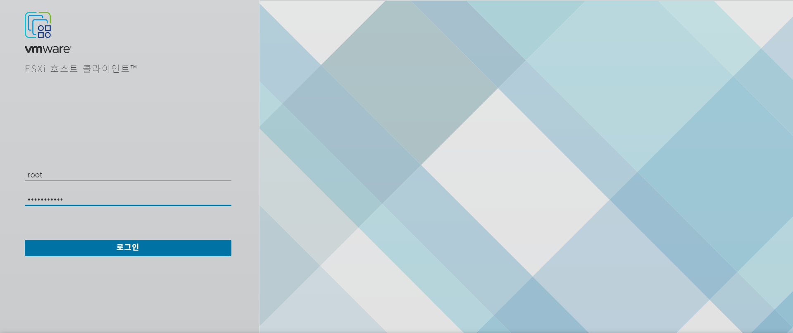

이후 시스템 설정이 완료된 뒤, 화면에 나오는 ip로 브라우저 접속시 위와 같은 인터페이스가 나온다.

### 초기 설정

브라우저에서 `https://<ESXi_IP>` 접속 후 root 계정으로 로그인.

**1. 데이터스토어 생성** (VM 저장 공간 — 필수)
```
좌측 메뉴 → 스토리지 → 새 데이터스토어
→ VMFS 데이터스토어 생성
→ 이름: datastore1
→ 디스크 선택 → 파티셔닝: 전체 디스크 사용 → 완료
```

**2. SSH 활성화** (선택, CLI 작업 시 필요)
```
좌측 메뉴 → 관리 → 서비스 탭
→ TSM-SSH 선택 → 시작 버튼 클릭
```

**3. 네트워크 확인**
```
좌측 메뉴 → 네트워킹
→ 가상 스위치: vSwitch0에 vmnic 연결 확인
→ 포트 그룹: VM Network 존재 확인
```

> **확인 방법**: 좌측 메뉴 → 호스트 → 요약 화면에서 CPU/메모리/스토리지 사용량이 정상 표시되고, 스토리지 NaN% 경고가 사라지면 초기 설정 완료.

---

## 4. 기본 사용법

### UI 기준 (VMware Host Client)

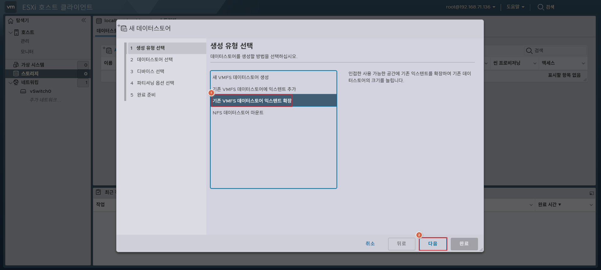

**주요 메뉴/패널 설명**
- **호스트**: ESXi 전체 요약. CPU·메모리·스토리지 사용량, 버전, 가동 시간 확인
- **가상 시스템**: VM 목록 조회 및 전원 제어(켜기/끄기/재시작), 콘솔 접속, 스냅샷 관리
- **스토리지**: 데이터스토어 용량 확인, ISO·VMDK 파일 업로드/다운로드
- **네트워킹**: vSwitch·포트그룹 생성 및 관리, 물리 NIC 연결 설정
- **모니터**: CPU·메모리·네트워크·디스크 I/O 실시간 그래프
- **관리**: SSH·Shell 서비스 제어, 라이선스 등록, 고급 시스템 설정

### CLI 기준

**기본 실행** (SSH 접속 후)
```bash
ssh root@<ESXi_IP>
```

**자주 쓰는 옵션**
```bash
# VM 목록 확인
vim-cmd vmsvc/getallvms

# VM 전원 켜기 / 끄기
vim-cmd vmsvc/power.on <VMID>
vim-cmd vmsvc/power.off <VMID>

# 네트워크 인터페이스 확인
esxcli network nic list

# 스토리지 목록 확인
esxcli storage filesystem list
```

---

## 5. 주요 명령어 / 설정 치트시트

```bash
# ── 시스템 정보 ──────────────────────────────
vmware -v                              # ESXi 버전 확인
esxcli system hostname get            # 호스트명 확인
esxcli hardware cpu global get        # CPU 정보
esxcli hardware memory get            # 메모리 정보

# ── 네트워크 ────────────────────────────────
esxcli network nic list               # 물리 NIC 목록
esxcli network ip interface ipv4 get  # IP 주소 확인
esxcli network vswitch standard list  # vSwitch 목록
esxcli network firewall get           # 방화벽 상태

# ── 스토리지 ────────────────────────────────
esxcli storage filesystem list        # 데이터스토어 목록
esxcli storage core device list       # 스토리지 디바이스 목록

# ── VM 관리 ────────────────────────────────
vim-cmd vmsvc/getallvms               # 전체 VM 목록 (VMID 포함)
vim-cmd vmsvc/power.on <VMID>         # VM 전원 켜기
vim-cmd vmsvc/power.off <VMID>        # VM 전원 끄기 (강제)
vim-cmd vmsvc/power.shutdown <VMID>   # VM 정상 종료
vim-cmd vmsvc/power.reboot <VMID>     # VM 재시작
vim-cmd vmsvc/power.getstate <VMID>   # VM 전원 상태 확인
vim-cmd vmsvc/snapshot.create <VMID> "스냅샷명" "설명" 0 0  # 스냅샷 생성
vim-cmd vmsvc/snapshot.get <VMID>     # 스냅샷 목록 확인
vim-cmd vmsvc/snapshot.revert <VMID> <SnapshotID> 0        # 스냅샷 복구

# ── 서비스 관리 ─────────────────────────────
vim-cmd hostsvc/enable_ssh            # SSH 활성화
vim-cmd hostsvc/start_ssh             # SSH 서비스 시작

# ── 로그 확인 ───────────────────────────────
tail -f /var/log/vmkernel.log         # VMkernel 로그
tail -f /var/log/hostd.log            # Host 데몬 로그
```

### 주요 설정 파일
| 파일 경로 | 용도 |
|-----------|------|
| `/etc/vmware/esx.conf` | ESXi 핵심 설정 (네트워크, 스토리지 등) |
| `/etc/hosts` | 호스트 이름-IP 매핑 |
| `/etc/vmware/hostd/config.xml` | hostd 데몬 설정 |
| `/etc/vmware/firewall/` | 방화벽 규칙 XML 파일들 |
| `/vmfs/volumes/` | 데이터스토어 마운트 경로 |
| `/var/log/vmkernel.log` | VMkernel 주요 로그 |
| `/var/log/hostd.log` | Host 관리 데몬 로그 |

---

## 6. 실습 예시

### 시나리오: Ubuntu VM 생성 및 SSH 접속
**목표**: Host Client GUI에서 Ubuntu Server VM을 만들고 SSH로 접속한다.

**환경**
- ESXi Host IP: 192.168.71.136
- VM OS: Ubuntu Server 22.04 LTS
- 네트워크: VM Network (브릿지)

**Step 1 — ISO 업로드**
```
Host Client → 스토리지 → 데이터스토어 브라우저
→ 업로드 → ubuntu-22.04-live-server-amd64.iso 선택
```
결과: 데이터스토어 브라우저에서 ISO 파일 확인 가능

**Step 2 — VM 생성**
```
가상 시스템 → VM 생성/등록 → 새 가상 시스템 생성
→ 이름: ubuntu-server-01
→ 게스트 OS: Linux / Ubuntu Linux (64비트)
→ CPU: 2 / 메모리: 2GB / 디스크: 20GB
→ CD/DVD: 업로드한 ISO 선택
```
결과: VM 목록에 ubuntu-server-01 등록 확인

**Step 3 — OS 설치 및 SSH 접속**
```bash
# VM 전원 켜기 후 콘솔에서 Ubuntu 설치 완료
# VM 내부에서 IP 확인
ip addr show

# 호스트에서 SSH 접속
ssh ubuntu@<VM_IP>
```
결과: `ubuntu@ubuntu-server-01:~$` 프롬프트 표시되면 성공

> **예상 결과**: SSH 접속 성공 및 VM 내부 쉘 진입

---

## 7. 트러블슈팅

| 증상 | 원인 | 해결 방법 |
|------|------|-----------|
| Host Client 접속 불가 | hostd 데몬 다운 또는 방화벽 차단 | DCUI → F2 → Restart Management Agents 실행 |
| 스토리지 NaN% 표시 | 데이터스토어 미구성 | 스토리지 → 새 데이터스토어 → VMFS 생성 |
| VM 전원 켜기 시 "No space left" | 데이터스토어 용량 부족 | 불필요한 스냅샷·VMDK 삭제 후 재시도 |
| VM 콘솔 검은 화면 | VMware Tools 미설치 또는 그래픽 드라이버 문제 | VM 내 VMware Tools 설치 또는 VM 재시작 |
| SSH 접속 거부 | SSH 서비스 비활성화 | 관리 → 서비스 → TSM-SSH 시작 |
| VM 네트워크 연결 안됨 | vSwitch 또는 포트그룹 설정 오류 | 네트워킹 → vSwitch0에 vmnic 연결 및 포트그룹 확인 |
| ESXi 설치 시 CPU 지원 오류 | VT-x/AMD-V 비활성화 | Workstation VM 설정 → Processors → Virtualize Intel VT-x/EPT 체크 |
| 라이선스 만료 경고 | 평가판 60일 만료 | Broadcom 포털에서 무료 키 발급 후 관리 → 라이선스 등록 |

---

## 8. 참고 자료
- [VMware vSphere 공식 문서 (Broadcom TechDocs)](https://techdocs.broadcom.com/us/en/vmware-cis/vsphere.html)
- [ESXi 8.0 설치 가이드](https://techdocs.broadcom.com/us/en/vmware-cis/vsphere/vsphere/8-0/esx-installation-and-setup.html)
- [ESXi 하드웨어 요구사항](https://techdocs.broadcom.com/us/en/vmware-cis/vsphere/vsphere/8-0/esx-installation-and-setup/installing-and-setting-up-esxi-install/esxi-requirements-install/esxi-hardware-requirements-install.html)
- [VMware Host Client 사용 가이드](https://techdocs.broadcom.com/us/en/vmware-cis/vsphere/vsphere/8-0/vsphere-single-host-management-vmware-host-client.html)
- [ESXCLI 명령어 레퍼런스](https://techdocs.broadcom.com/us/en/vmware-cis/vsphere/vsphere/8-0/esxcli-command-reference.html)
- [Broadcom 무료 라이선스 발급](https://support.broadcom.com/group/ecx/productfiles?subFamily=VMware%20vSphere%20Hypervisor)