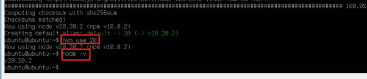
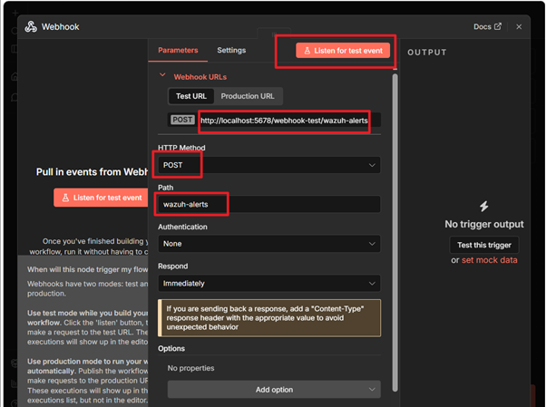
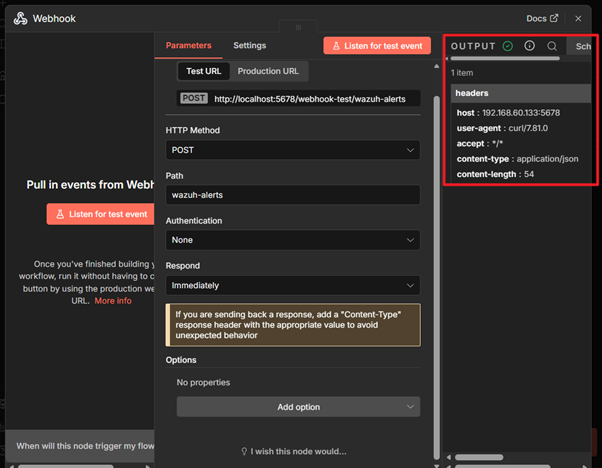

# n8n

> **한 줄 요약**: 노드 기반의 워크플로우 자동화 툴


---

## 1. 개요

### 이 툴이 뭔가
- 다양한 앱과 서비스를 서로 연결해서 복잡한 업무 프로세스를 코딩 없이(또는 최소한의 코딩으로) 자동화할 수 있게 해주는 노드 기반의 워크플로우 자동화 툴임


### 어디서 만들었나
- **개발사 / 프로젝트**: On8n GmbH
- **라이선스**: n8n Fair-Code License v1.1 (https://github.com/n8n-io/n8n/blob/master/LICENSE.md)
- **공식 사이트**: https://n8n.io/

### 어떤 상황에서 쓰나
- 주로 **데이터 파이프라인 구축, 반복적인 업무 자동화, 서로 다른 SaaS 서비스 간의 데이터 동기화**가 필요할 때 사용됨
- **복합 워크플로우 자동화:** 단순히 한 단계의 자동화가 아니라, 조건문(IF)과 반복문(Loop)이 포함된 복잡한 로직을 시각적으로 설계해야 할 때 유용함
- **데이터 보안 및 비용 최적화:** 민감한 기업 데이터를 외부 서버에 보내지 않고 사내 서버(On-premise)에 직접 설치하여 운영하고 싶을 때 사용함
- **커스텀 기능 구현:** 표준화된 커넥터 외에도 직접 JavaScript 코드를 작성하여 고유한 비즈니스 로직을 자동화에 포함하고 싶을 때 사용함

### 비슷한 툴과 비교
| 툴 | 특징 | 차이점 |
| :--- | :--- | :--- |
| Zapier | - 사용이 매우 쉬움 <br>- 많은 앱을 지원함 | - 클라우드 전용 <br>- 단계가 많아질수록 비용이 급격히 상승함 |
| Make (Integromat) | - 시각적으로 뛰어남 <br>- 복잡한 로직 지원함 | - 데이터 처리량에 따른 유료 모델이 까다로움 <br>- 학습 곡선이 다소 있음 |
|Shuffle| - 보안 자동화(SOAR)에 특화| - docker를 사용하지 않을 예정 <br>= 이중 가상화는 하지 않을 예정|
| **n8n** | - 노드 기반의 오픈 소스 및 설치형 자동화 | **← 이거 씀** |
---

## 2. 핵심 기능

| 기능 | 설명 |
| :--- | :--- |
| **Workflow Designer** | 캔버스 위에서 노드를 드래그 앤 드롭하여 시각적으로 자동화 흐름을 설계하는 인터페이스 |
| **Integrations (Nodes)** | 400개 이상의 타 서비스(Gmail, Slack, AWS 등)와 즉시 연결 가능한 프리빌트 커넥터 |
| **JavaScript Editor** | 특정 노드 사이에서 데이터를 정밀하게 가공해야 할 때 직접 코드를 작성할 수 있는 기능 |
| **Webhook Support** | 외부 서비스에서 발생한 이벤트를 실시간으로 수신하여 즉각적으로 워크플로우를 시작하는 트리거 |
| **Self-Hosting** | Docker 등을 통해 본인의 서버에 직접 설치하여 데이터 제어권과 보안을 확보할 수 있는 구조 |

---

## 3. 설치 방법

### 요구사항
| 항목 | 최소 사양 | 권장 사양 |
| :--- | :--- | :--- |
| OS | Linux (Ubuntu 20.04+), Docker 지원 OS | Linux (Ubuntu 22.04+), Docker 환경 |
| CPU | 1 Core (x86_64 또는 ARM64) | 2 Cores 이상 |
| RAM | 1GB (Node.js 실행을 위한 최소 공간) | 2GB ~ 4GB 이상 |
| 디스크 | 2GB 이상의 여유 공간 | 10GB 이상 (로그 및 데이터 축적 대비) |
| 기타 | Node.js 18.x+, Docker & Docker Compose | PostgreSQL (데이터 보존용 외부 DB) |

### 설치 단계  
조건  
- ubuntu serever 22.04 (vmware)  
- node 20.20.2  

**Step 1 — [nvm(Node Version Manager) 설치]**  
```bash  
sudo apt update   

#nvm 설치 스크립트   
curl -o- https://raw.githubusercontent.com/nvm-sh/nvm/v0.39.7/install.sh | bash   

#설정 반영    
#터미널 재시작 효과  
source ~/.bashrc   
```  
  
  
  
**Step 2 — [Node.js 20 버전 설치]**    
```bash  
nvm install 20  
nvm use 20  
node -v  
```  
  
  
  
  
**Step 3 — [n8n 설치, 실행 및 백그라운드 유지]**  
```bash  
npm install n8n -g  

# PM2 설치  
# SOAR 서버처럼 계속 켜두려면 PM2라는 도구를 사용해야함  
npm install pm2 -g   

# n8n을 PM2로 실행  
export N8N_SECURE_COOKIE=false  
pm2 start n8n  

# 서버 재부팅 시에도 자동으로 켜지게 설정  
pm2 startup  
pm2 save  

```
  
  
  
### wazuh와 n8n 연결하기  

**Step 0 — [N8n 들어가기]**  
```bash
# 터미널 재시작 할 경우

# 1. 상태 확인
Pm2 status

# 1-1. 만약 아무것도 안나온다면
N8N_SECURE_COOKIE=false pm2 start n8n

# 2. 들어가기
# 2-1. Ip 주소 확인
Ip a

# 2-2. n8n 들어가기 
http://[ip주소]:5678
```
  
  
  
**Step 1 — [SIEM 연동을 위한 네트워크 설정]**  
```bash
# n8n    
sudo ufw enable  
sudo ufw allow 5678/tcp  
sudo ufw reload  

```
  
  
  
**Step 2 — [wazuh 설정]**
```bash
# API 포트인 55000/TCP번을 n8n 서버의 IP에 대해 허용해주기
sudo ufw allow from 192.168.0.100 to any port 55000 proto tcp
```
  
  
  
**Step 3 — [n8n 서버에서 '수신 대기소' 만들기]**  
```bash
# Webhook 노드 추가
HTTP Method: POST
Path: wazuh-alerts
Webhook URL 복사해두기
Listen for Test Event 누르기 

```
  
  
  
  
**Step 4 — [Wazuh 서버에서 '전달자' 스크립트 작성]**  
```bash
sudo nano /var/ossec/integrations/custom-n8n.py
```
  
- 편집기가 열리면 아래의 내용 붙혀넣기  
```bash
#!/usr/bin/env python3  
import sys  
import json  
import requests  

# Step 3에서 복사한 Webhook URL 
webhook_url = "[Webhook URL]"  

# Wazuh로부터 데이터 읽기
alert_file = open(sys.argv[1])
alert_json = json.load(alert_file)
alert_file.close()

# n8n으로 전송
requests.post(webhook_url, json=alert_json)
```
- ctrl+o -> enter -> ctrl+x로 나오기  
  
```bash  
sudo chown root:wazuh /var/ossec/integrations/custom-n8n.py
sudo chmod 750 /var/ossec/integrations/custom-n8n.py
```
  
  
  
**Step 5 — [Wazuh 설정 파일에 '연결 규칙' 등록]**  
```bash
sudo nano /var/ossec/etc/ossec.conf  
```
  
- 편집기가 열리면 아래의 내용 붙혀넣기  
```bash
# 파일 맨 아래쪽 </ossec_config> 바로 위에 붙혀넣기
  <integration>
    <name>custom-n8n.py</name>
    <level>7</level> <alert_format>json</alert_format>
  </integration>

```
- ctrl+o -> enter -> ctrl+x로 나오기  
  
```bash
sudo systemctl restart wazuh-manager
```
  
  
  
**Step 6 — [와쥬에서 신호 보내기]**  
```bash  
# 아까 n8n에서 복사해놓은 Webhook URL 넣으면 됨  
# 저 url이 안먹으면 localhost 대신 n8n의 ip를 넣어주면 됨  
curl -X POST ‘[Webhook URL]’ \  
-H "Content-Type: application/json" \  
-d '{"status": "connection_test", "from": "wazuh_manager"}'  
```
  
  
  
> **확인 방법**: 
- n8n 사이트로 돌아가보면 output 쪽에 띠롱 하고 와 있음  
  
  
  
  
---

