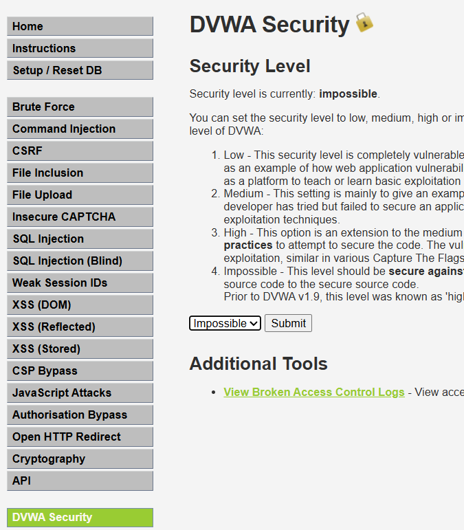
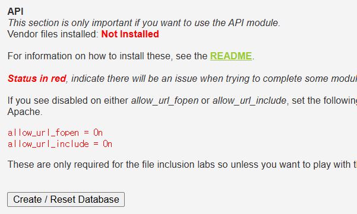
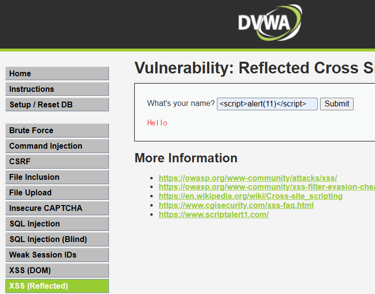

# DVWA(Damn Vulnerable Web Application)

> **한 줄 요약**: 웹 보안 취약점 학습을 위해 의도적으로 취약하게 만들어진 PHP/MySQL 기반 웹 애플리케이션

---

## 1. 개요

### 이 툴이 뭔가
DVWA는 웹 애플리케이션의 대표적인 보안 취약점을 실습하기 위해 만들어진 교육용 플랫폼이다.
SQL Injection, XSS, CSRF 등 다양한 공격 기법을 실제로 테스트해볼 수 있도록 설계되어 있으며, 난이도 조절 기능을 통해 초보자부터 숙련자까지 학습할 수 있다.
보안 교육, CTF 준비, 모의 해킹 입문 등에 널리 사용된다.

### 어디서 만들었나
- **개발사 / 프로젝트**: DVWA Project
- **라이선스**: GNU General Public License (GPL)
- **공식 사이트**: https://github.com/digininja/DVWA

### 어떤 상황에서 쓰나
- 웹 해킹 및 보안 취약점 학습
- 모의 해킹(Penetration Testing) 연습 환경 구축
- 보안 교육 및 워크숍 실습
- CTF 대회 대비 연습

### 비슷한 툴과 비교
| 툴 | 특징 | 차이점 |
|----|------|--------|
| OWASP Juice Shop |최신 웹 취약점 포함, Node.js 기반 |UI/UX 현대적, 실제 서비스와 유사 |
| WebGoat |교육 중심, 단계별 학습 구조 |이론 + 실습 병행 |
| **DVWA** |PHP 기반, 가볍고 직관적 |설치 간단, 난이도 조절 가능 |

---

## 2. 핵심 기능

| 기능                     | 설명                       |
| ---------------------- | ------------------------ |
| SQL Injection 실습       | 다양한 난이도에서 SQLi 공격 테스트 가능 |
| XSS (Stored/Reflected) | 클라이언트 공격 이해              |
| CSRF 공격 실습             | 인증 기반 공격 시나리오 학습         |
| Brute Force            | 로그인 크래킹 공격 연습            |
| File Upload 취약점        | 웹쉘 업로드 실습                |
| Command Injection      | 시스템 명령 실행 취약점 테스트        |


---

## 3. 설치 방법

### 요구사항
| 항목  | 최소 사양                   | 권장 사양           |
| --- | ----------------------- | --------------- |
| OS  | Linux / Windows / macOS | Linux           |
| CPU | 1 Core                  | 2 Core 이상       |
| RAM | 1GB                     | 2GB 이상          |
| 디스크 | 500MB                   | 1GB 이상          |
| 기타  | PHP, MySQL, Apache      | XAMPP 또는 Docker |


### 설치 단계
**Step 1 — 저장소 클론**
```bash
sudo apt install -y apache2 mariadb-server php php-mysqli php-gd php-xml php-mbstring git libapache2-mod-php
```

**Step 2 — Apache 실행 확인**
```bash
sudo systemctl start apache2
sudo systemctl enable apache2
```

**Step 3 — DB 설정 (MariaDB)**
```bash
sudo mysql_secure_installation
```

- pw 설정
- `Switch to unix_socket authentication [Y/n] Y`
    - unix_socket 인증 사용
    - `sudo mysql` → 바로 접속 가능
    - 비밀번호 입력 필요 없음
    - root 계정은 **리눅스 root만 접근 가능**
- `Change the root password? [Y/n] Y`
- `Remove anonymous users? [Y/n] Y`
- `Disallow root login remotely? [Y/n] Y`
- `Remove test database and access to it? [Y/n] Y`
- `Reload privilege tables now? [Y/n] Y`

DVWA용 DB 생성  
```bash
sudo mysql -u root -p
```
```SQL
CREATE DATABASE dvwa;
CREATE USER 'dvwa'@'localhost' IDENTIFIED BY 'dvwa123';
GRANT ALL PRIVILEGES ON dvwa.* TO 'dvwa'@'localhost';
FLUSH PRIVILEGES;
EXIT;
```

**Step 4 — DVWA 다운로드**
```bash
cd /var/www/html
sudo git clone https://github.com/digininja/DVWA.git
```

**Step 5 — 권한 설정**
```bash
sudo chown -R www-data:www-data DVWA
sudo chmod -R 755 DVWA
```

**Step 6 — 설정 파일 수정**
```bash
cd DVWA/config
sudo cp config.inc.php.dist config.inc.php
sudo vim config.inc.php
```
아래 부분 수정
```php
$_DVWA[ 'db_user' ] = 'dvwa';
$_DVWA[ 'db_password' ] = 'dvwa123';
$_DVWA[ 'db_database' ] = 'dvwa';
```

**Step 7 — PHP 설정 수정**
```bash
sudo vim /etc/php/8.1/apache2/php.ini
```
아래 부분 수정
```ini
allow_url_include = On
allow_url_fopen = On
```

**Step 8 — Apache 재시작**
```bash
sudo systemctl restart apache2
```

**Step 9 — 접속 및 초기 설정**
```
http://서버IP/DVWA
```
페이지 하단:
- "Create / Reset Database" 클릭

---

## 4. 기본 사용법

### UI 기준
<!-- 주요 화면 구성 설명, 스크린샷 삽입 위치 표시 -->



**주요 메뉴/패널 설명**
- **DVWA Security**: 보안 난이도 설정 (Low / Medium / High / Impossible)
- **Vulnerabilities**: 각종 취약점 실습 메뉴
- **Setup**: DB 초기화 및 설정
- **Login**: 기본 계정 로그인 (admin / password)

---

## 5. 주요 명령어 / 설정 치트시트

```bash
# ── 자주 쓰는 명령어 ──────────────────────

git clone https://github.com/digininja/DVWA.git   # DVWA 다운로드
cp config.inc.php.dist config.inc.php             # 설정 파일 생성
chmod -R 755 DVWA                                 # 권한 설정
service apache2 start                             # 웹 서버 실행
service mysql start                               # DB 실행
```

### 주요 설정 파일
| 파일 경로                    | 용도        |
| ------------------------ | --------- |
| `/config/config.inc.php` | DB 연결 설정  |
| `/php.ini`               | PHP 환경 설정 |
| `/var/www/html/DVWA`     | 웹 루트 경로   |

---

## 6. 실습 예시

### 시나리오: XSS (Reflected) 공격
**목표**: JS 스크립트 삽입하여 공격

**환경**
- 공격자: 사용자
- 대상: DVWA XSS (Reflected) 페이지
- 조건: Security Level = Low

**Step 1 — 취약 페이지 접속**
```bash
http://localhost/DVWA/vulnerabilities/xss_r/
```
결과: ID 입력 폼 확인

**Step 2 — 공격 입력**
```bash
<script>alert(11)</script>
```
결과: `alert` 함수 실행

**Step 3 — 결과 확인**  




결과: 스크립트 실행

---

## 7. 트러블슈팅

| 증상       | 원인        | 해결 방법                 |
| -------- | --------- | --------------------- |
| 로그인 실패   | DB 계정/비밀번호/권한 설정 문제 | 사용자/권한 다시 생성 및 DVWA 설정 파일 수정    |

---

## 8. 참고 자료
- [GitHub](https://github.com/digininja/DVWA)
