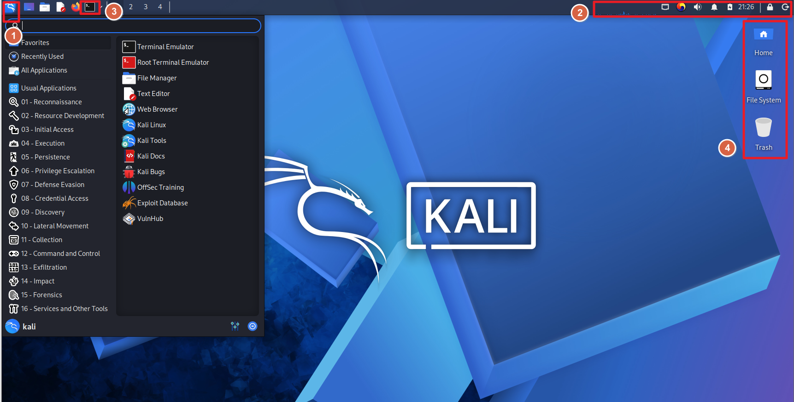

# Kali Linux

> **한 줄 요약**: 보안 및 모의 해킹에 특화된 데비안 기반의 오픈 소스 리눅스 배포판


---

## 1. 개요

### 이 툴이 뭔가
- 보안 테스트를 위한 Linux 배포판


### 어디서 만들었나
- **개발사 / 프로젝트**: Offensive Security(현재는 OffSec으로 사명 변경) / Kali Linux Project
- **라이선스**: GNU GPL (General Public License) - 오픈소스
- **공식 사이트**: https://www.kali.org

### 어떤 상황에서 쓰나
<!-- 이 툴이 실무에서 어떤 상황에 주로 쓰이는지 -->
- 시스템의 취약점을 사전에 발견하기 위해 공격자의 관점에서 보안 테스트를 수행할 때 사용
- 침투 테스트 및 공격 자동화에 사용할 예정


### 비슷한 툴과 비교
| 툴 | 특징 | 차이점 |
|----|------|--------|
| Parrot Security OS | 침투 테스트, 프라이버시 보호, 개발까지 가능함 <br> Kali보다 가볍고 빠름| 침투 테스트보다는 프라이버시(익명성)와 경량성에 더 초점|
| BlackArch Linux |도구 수 많고 최신 기능 빠름| 설치/사용 난이도 높고 안정성 낮음|
| **Kali Linux** |도구 호환성과 자료가 더 풍부함<br>검증된 도구 + 안정적인 환경 제공 | **← 이거 씀** |

---

## 2. 핵심 기능

| 기능 | 설명 |
|------|------|
| 침투 테스트 (Penetration Testing) | 시스템, 서버, 네트워크를 공격자의 관점에서 점검 <br>**대표 도구**: Metasploit(취약점 공격/모의 침투), Nmap(네트워크 스캔/포트 분석), Hydra(비밀번호 크래킹). |
| 웹 해킹 / 애플리케이션 보안 | 웹사이트 보안 취약점 탐지 <br>**대표 도구**: Burp Suite(웹 요청/응답 분석), SQLmap(SQL Injection 테스트), OWASP ZAP(자동화 웹 취약점 스캐닝) |
| 네트워크 분석 및 공격 | Wi-Fi/LAN 공격 및 패킷 분석 <br>**대표 도구**: Aircrack-ng(Wi-Fi 암호 해킹), Wireshark(패킷 캡처 및 분석) |
| 악성코드 분석 & 리버스 엔지니어링 | 의심 파일 동작 분석 <br>**대표 도구**: Ghidra, Radare2(리버스 엔지니어링), Volatility(메모리 분석) |
| 디지털 포렌식 | 삭제된 파일 복구, 로그 분석 <br>**대표 도구**: Autopsy, Sleuth Kit(증거 분석), FTK Imager(디스크 이미지 분석) |
| 보안 실습 및 학습 | CTF, 해킹 교육, 자격증 실습 <br>**대표 환경**: 실습용 VM, 네트워크 공격 시뮬레이션 |

---

## 3. 설치 방법

### 요구사항
| 항목 | 최소 사양 | 권장 사양 |
|------|-----------|-----------|
| OS | 1GHz 이상의 32-bit 또는 64-bit CPU | 최신 64-bit Linux (가상환경/듀얼부팅 포함) |
| CPU | x86 1GHz 이상 | 듀얼코어 이상 (Intel i5 / Ryzen 5 이상) |
| RAM | 2GB | 4GB ~ 8GB |
| 디스크 | 20GB | 50GB 이상 |
| 기타 |  CD-DVD 드라이브 또는 USB 부팅 지원 | 가상화 지원(VT-x/AMD-V), GPU(Optional) |

### 설치 단계
vmware, kali-linux-2026.1-vmware-amd64 기준

**Step 1 — [image download]**  
https://www.kali.org/get-kali/#kali-virtual-machines


**Step 2 — [부팅 설정]**  
kali GNU/Linux 선택


**Step 3 — [로그인]**  
ID : kali  
passwd : kali  


### 초기 설정


**Step 1 — [루트계정 활성화]**
```bash
sudo passwd root
su -
```


**Step 2 — [한글 설치]**
```bash
sudo apt update
sudo apt install ibus ibus-hangul fonts-nanum --fix-missing
im-config
sync
reboot
```
그 이후  
1. ibus preferences 들어가기  
2. input method에 add 누르고 korean 검색해서 'Hangul' 클릭  


**Step 3 — [SSH 설치]**
```bash
sudo apt-get install openssh-server
service ssh start
netstat -tuln | grep 22 # 열려있는지 확인
sudo update-rc.d ssh enable
```

> **확인 방법**: 설치가 잘 됐는지 확인하는 명령어 또는 방법

```bash
cat /etc/os-release
```
Kali GNU/Linux 나오면 정상 설치


---

## 4. 기본 사용법

### UI 기준 (해당 시)
<!-- 주요 화면 구성 설명, 스크린샷 삽입 위치 표시 -->



**주요 메뉴/패널 설명**
**1. [Kali Menu]**  
- 용 문양 아이콘  
- 모든 보안 도구가 집약된 시작 메뉴
- 침투 단계에 맞춰 도구들이 분류되어 있음
  
**2. [Top Panel]**  
- 상단 패널  
- 시스템의 현재 상태를 한눈에 파악가능
- 작업 공간 전환기, 시스템 리소스 모니터, 네트워크 연결 상태, 알림 및 시계

**3. [Terminal Emulator]**  
- 터미널  
- 칼리 리눅스 활용의 90% 이상이 이루어지는 인터페이스
  
**4. [Desktop Shortcuts]**  
- 바탕화면 아이콘  
  

  

### CLI 기준 (해당 시)

**기본 실행**
```bash
# 패키지 목록 업데이트 및 설치된 도구 전체 업그레이드  
sudo apt update && sudo apt full-upgrade -y  

# 도구 설치  
sudo apt install nmap [도구명]  
  
# 현재 네트워크 인터페이스 및 IP 정보 확인 
ip a  
```

**자주 쓰는 옵션**
```bash
# 1. [apt]  
apt search [키워드]      # 저장소 내 특정 도구 검색  
apt show [패키지명]      # 해당 도구의 상세 정보 및 버전 확인  

# 2. [시스템 제어]  
sudo -i                # 루트(root) 권한 계정으로 완전히 전환  
systemctl start [서비스명] # 특정 서비스(ex. apache2) 실행  

# 3. [파일 작업]  
ls -al                 # 숨김 파일을 포함한 모든 파일의 상세 정보 출력  
chmod +x [파일명]       # 다운로드한 스크립트 등에 실행 권한 부여  
```

---

## 5. 주요 명령어 / 설정 치트시트

```bash
# ── 자주 쓰는 명령어 ──────────────────────

find / -name "*.txt" 2>/dev/null   # 루트부터 파일 검색, 오류 출력은 버림
ping <IP 또는 도메인>               # 대상 시스템 연결 확인
tmux                              # 터미널 분할 및 세션 관리
nmap -sV <IP>                     # 포트 스캔 및 서비스 버전 탐지
searchsploit                      # 공개된 취약점 및 익스플로잇 검색
msfconsole                        # Metasploit(= 취약점 분석) 실행
john                              # 패스워드 크래킹 도구
base64 -d                         # Base64 디코딩
```

### 주요 설정 파일
| 파일 경로 | 용도 |
|-----------|------|
| `/etc/sudoers` | **권한 상승:** root 권한 탈취의 직접적인 통로임 |
| `/etc/shadow` | **인증 정보 탈취:** 사용자들의 비밀번호가 저장된 파일로 탈취 시 오프라인 비밀번호 크래킹의 대상이 됨 |
| `/etc/hosts` | **내부망 정찰:** IP 주소와 호스트네임 정보를 담고 있음. 내부 주요 서버의 위치 파악이 가능함 |
| `/etc/proxychains4.conf` | **트래픽 우회:** 공격 트래픽을 프록시 서버나 감염된 시스템(Pivot)을 통해 전달하기 위한 터널링 설정에 사용됨 |
| `~/.bashrc` | **지속성 유지:** 사용자 로그인 시마다 특정 스크립트가 실행되도록 설정할 수 있음 |
| `/etc/ssh/sshd_config` | **원격 접속 제어:** SSH 접속 정책을 관리하며, 루트 로그인 허용이나 키 기반 인증 설정을 변경하여 재접속 통로를 확보함 |
| `/etc/apt/sources.list` | **인프라 분석:** 업데이트 서버 경로를 통해 타겟 조직 내부의 미러 서버 주소나 사용 중인 소프트웨어 환경을 유추함 |
| `/var/log/auth.log` | **계정 수집:** 로그인 시도 및 성공 기록을 모니터링함. 시스템 침입 흔적을 분석함 |
---

## 6. 실습 예시

### 시나리오: [DoS 공격]

**목표**: hping3 툴을 활용한 Kali Linux에서의 DoS 공격  

**환경**
- 공격자 : kali linux  
- 대상 : Windows 11   

**Step 1 — [공격 대상 및 네트워크 확인]**
```bash
ping [대상ip]
```
결과: 대상 서버의 와이어샤크에서 Echo (ping) request, reply가 번갈아 오면 됨  


**Step 2 — [hping3 명령어를 이용한 SYN 패킷 생성]**
```bash
hping3 -S [대상ip] -p 8080 --rand-source
```
결과: ARP Who has xxx.xxx.xxx.xxx? Tell [공격자ip] 형식으로 찍힘  
계속 MAC 주소를 찾고 있다는 뜻임  


**Step 3 — [대량 트래픽 전송 (Flooding)]**
```bash
sudo hping3 -S 192.168.0.25 -p 8080 --rand-source --flood
```
결과: 다양한 src_ip로 tcp 프로토콜을 사용해서 대량의 트래픽이 들어오면 됨  


> **예상 결과**: 대상 시스템(Windows 11)이 임의의 IP들로부터 쏟아지는 대량의 SYN 패킷을 처리하느라 리소스를 소진하여, 정상적인 네트워크 서비스를 제공할 수 없는 서비스 거부(DoS) 상태에 빠지게 됨

---

## 7. 트러블슈팅

| 증상 | 원인 | 해결 방법 |
|------|------|-----------|
| VMware에서 실행 중인 Kali Linux의 마우스 커서가 보이지 않음 | 패키지 업데이트(APT Update) 후 가상 머신 하드웨어 호환성 문제 발생 | 1. 가상 머신 종료<br>2. VM > Manage > Change Hardware Compatibility 클릭<br>3. 하드웨어 호환성 버전(Workstation)을 최신 또는 이전 안정 버전으로 변경 후 재실행 |

---

## 8. 참고 자료
- [기타 참고 링크](
    - https://dpwl.tistory.com/entry/Linux-%EC%B9%BC%EB%A6%AC%EB%A6%AC%EB%88%85%EC%8A%A4-%EC%B4%88%EA%B8%B0%EC%84%A4%EC%A0%95%EB%AA%A8%EC%9D%98%EC%B9%A8%ED%88%AC%EC%9A%A9-%ED%99%98%EA%B2%BD%EA%B5%AC%EC%B6%95
    - https://blog.naver.com/snova84/223373614848
    - https://day-night.tistory.com/148

)
