# pfSense
FreeBSD 기반의 방화벽/라우터 소프트웨어
---

## 1. 개요

### 이 툴이 뭔가
일반 PC나 전용 어플라이언스 하드웨어에 설치해 상용 방화벽 장비를 대체.
웹 GUI를 통해 방화벽 룰, VPN, DHCP, DNS, IDS/IPS, 트래픽 쉐이핑 등 엔터프라이즈 수준의 네트워크 기능을 통합 관리.
유연한 방화벽 및 라우팅 플랫폼.
패키지 시스템을 제공하여 확장성 확보.
---

### 어디서 만들었나
- **개발사 / 프로젝트**: Rubicon Communications, LLC (Netgate)
- **라이선스**: Apache 2.0 open source license
- **공식 사이트**: https://www.pfsense.org/
---

### 어떤 상황에서 쓰나
중소기업 경계 방화벽 구축 (Cisco ASA, Fortinet 대체)
홈랩/테스트 환경에서 네트워크 세그멘테이션 구성
IDS/IPS(Suricata/Snort) 통합 운용
침투 테스트 환경에서 타깃 네트워크 환경 재현
---

### 비슷한 툴과 비교
| 툴 | 특징 | 차이점 |
|----|------|--------|
| OPNsense | pfSense 포크, 더 현대적인 UI/UX, HardenedBSD 기반 | 보안 업데이트가 더 빠름, UI가 더 직관적 |
| Sophos XG Home | 상용 방화벽의 홈 무료 버전 | 비오픈소스, 하드웨어 제약, 커스터마이징 제한 |
| VyOS | CLI 중심 라우터 OS, 엔터프라이즈 라우팅에 강함 | GUI 없음, 라우팅 기능이 더 강력하나 방화벽 기능은 약함 |
| IPFire | 경량 리눅스 기반 방화벽 | 기능 수가 적음, 소규모 환경에 적합 |
| pfSense | FreeBSD 기반, 패키지 생태계 풍부, 커뮤니티 방대 | ← 이거 씀 |
---

## 2. 핵심 기능
| 기능 | 설명 |
|------|------|
| 상태 기반 방화벽 (Stateful Firewall) | pf(packet filter) 엔진 기반. 인터페이스별 인바운드/아웃바운드 룰, 상태 테이블 관리, 별칭(Alias)을 통한 IP/포트 그룹화 |
| VPN (IPsec / OpenVPN / WireGuard) | Site-to-Site 및 Road Warrior VPN 구성. WireGuard는 pfSense 2.5+에서 패키지로 지원 |
| IDS/IPS 연동 | Suricata 또는 Snort 패키지 설치 후 인라인 모드(IPS)로 운용 가능. 룰셋 자동 업데이트 지원 |
| 트래픽 쉐이핑 (QoS) | HFSC, PRIQ, FAIRQ 등 스케줄러 지원. 특정 트래픽에 대역폭 우선순위 부여 |
| 멀티 WAN & 로드밸런싱 | 복수 ISP 연결 시 로드밸런싱 또는 페일오버 구성. 게이트웨이 그룹으로 관리 |
| DHCP / DNS Resolver | 내장 DHCP 서버 및 Unbound 기반 DNS Resolver. DHCP 고정 할당, DNS 오버라이드 지원 |
| 캡티브 포털 | 게스트 네트워크에서 인증 페이지 제공. 쿠폰 기반 접속 시간 제한도 가능 |
| HAProxy / Reverse Proxy | 패키지로 HAProxy 설치 시 L7 로드밸런싱 및 SSL 종료 처리 가능 |
---

## 3. 설치 방법

### 요구사항
| 항목 | 최소 사양 | 권장 사양 |
|------|-----------|-----------|
| OS | FreeBSD (pfSense 자체가 OS) | |
| CPU | 64비트, 600MHz | 1GHz 이상 멀티코어 (IDS/IPS 사용 시 필수) |
| RAM | 512MB | 2GB 이상 (Suricata/Snort 사용 시 4GB+) |
| 디스크 | 4GB | 16GB+ SSD (로그 및 패키지 저장 고려) |
| 기타 | 최소 2개 (WAN/LAN) | 인텔 기반 NIC 권장 (i350, i210 등) — Realtek은 불안정 가능 |
---

### 설치 단계
1. 공식 사이트에서 CE(Community Edition) ISO 다운로드
    https://www.pfsense.org/download/ → Architecture: AMD64, Installer: DVD Image (ISO)

2. 설치 
    NIC 2개 이상 사용하는 경우 참고   
    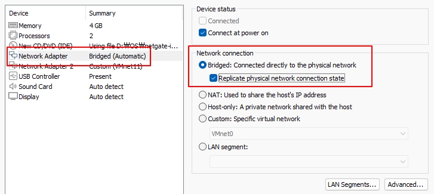
    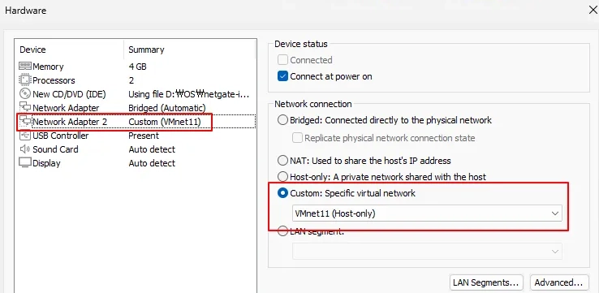
    ID : admin
    PW : pfsense 
    각 네트워크 구성도에 맞추어  LAN, WAN 등 네트워크 환경 수정 가능
    Security Onion 사용 시 NIC 추가
    EX 
    - [pfSense]—[Security Onion]—[window]
    - [Kali]
    ping, nslookup 등 네트워크 확인

3. LAN 기본 IP: 192.168.1.1
    LAN 측 클라이언트에서 브라우저로 접속
    https://192.168.1.1
---

### 초기 설정
Setup Wizard 자동 실행:
1. Hostname / Domain 설정
2. DNS 서버 설정 (예: 1.1.1.1, 8.8.8.8)
3. WAN 설정 (DHCP / Static / PPPoE 선택)
4. LAN IP 설정 (기본 192.168.1.1/24) -> vm의 경우 vmnet1 의 게이트웨이가 되도록 구성 
5. Admin 패스워드 변경
6. Finish → Reload
---

## 4. 기본 사용법

### UI 기준

> 포트포워딩 웹 서버 구축시 protocol 변경
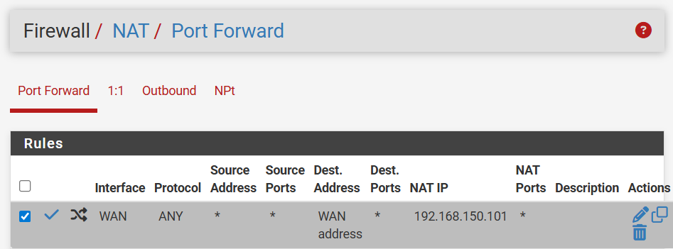 

> 기본 차단 룰
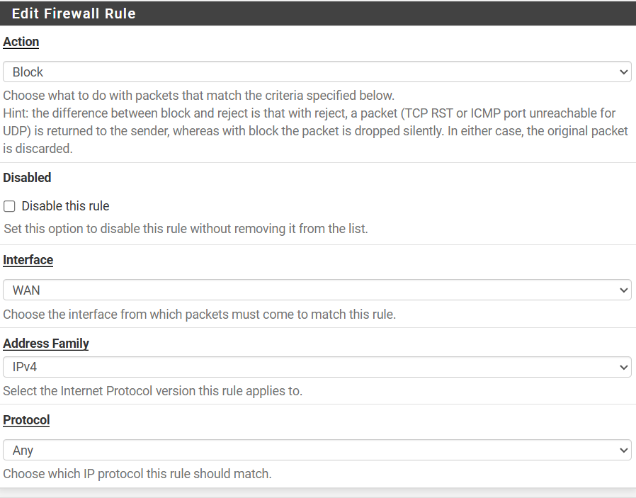
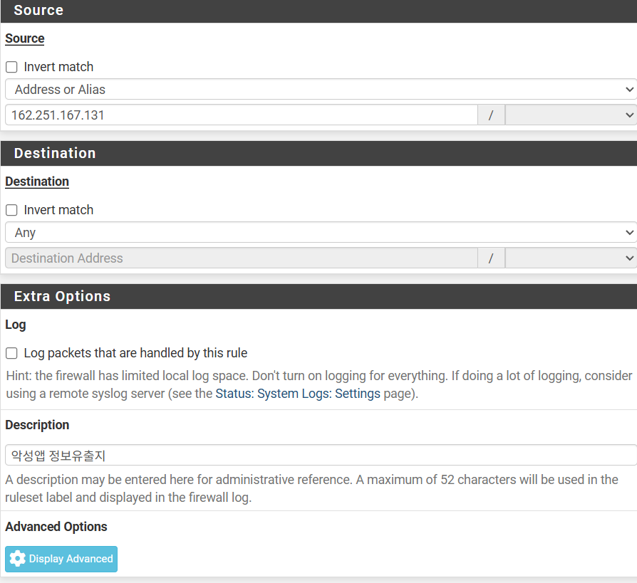

> Suricata Snort
Services → Suricata → Global Settings
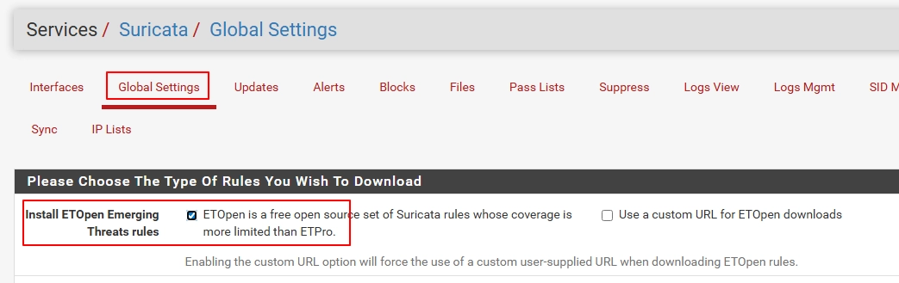
Install ETOpen Emerging Threats rules 선택
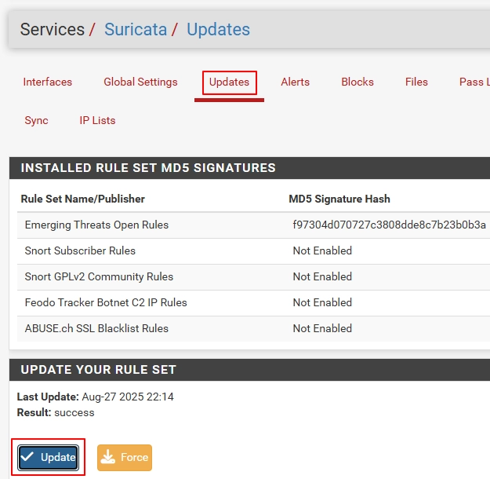
Services → Suricata → Updates
하단 Update 버튼 클릭

Interfaces 에서 우측 연필모양 버튼 클릭
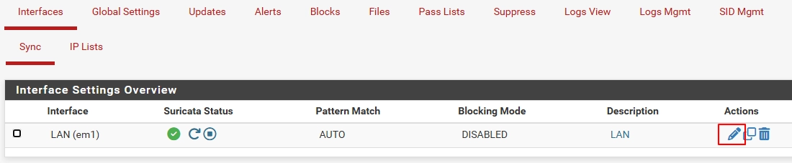
Lan Categories 클릭
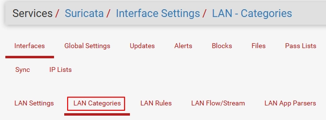
ET Open Rules Ruleset 확인 후 Select All 버튼 클릭 → Save
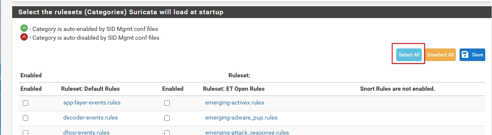
Custom Rule 사용 시(사용자가 직접 Snort Rule을 제작)
Interfaces → 연필모양 버튼 클릭 → LAN Rules → Category 에서 custom.rules 선택 → Defined Custom Rules에 제작한 Snort Rule 적으면 적용 가능, 꼭 Save 버튼 누르고
Suricat 서비스 재 시작 해야함
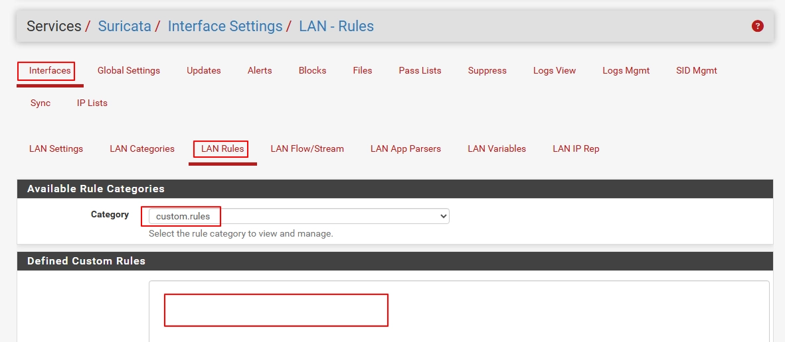
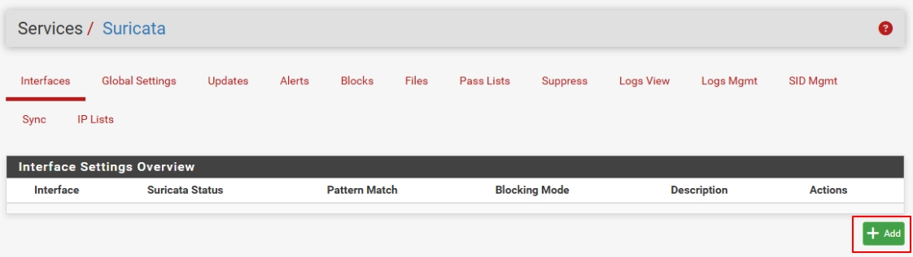
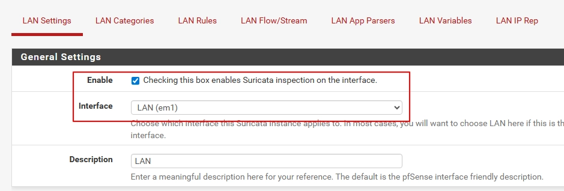
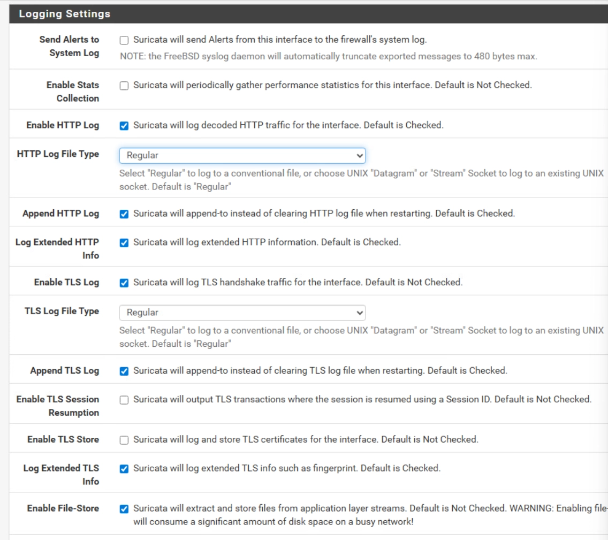
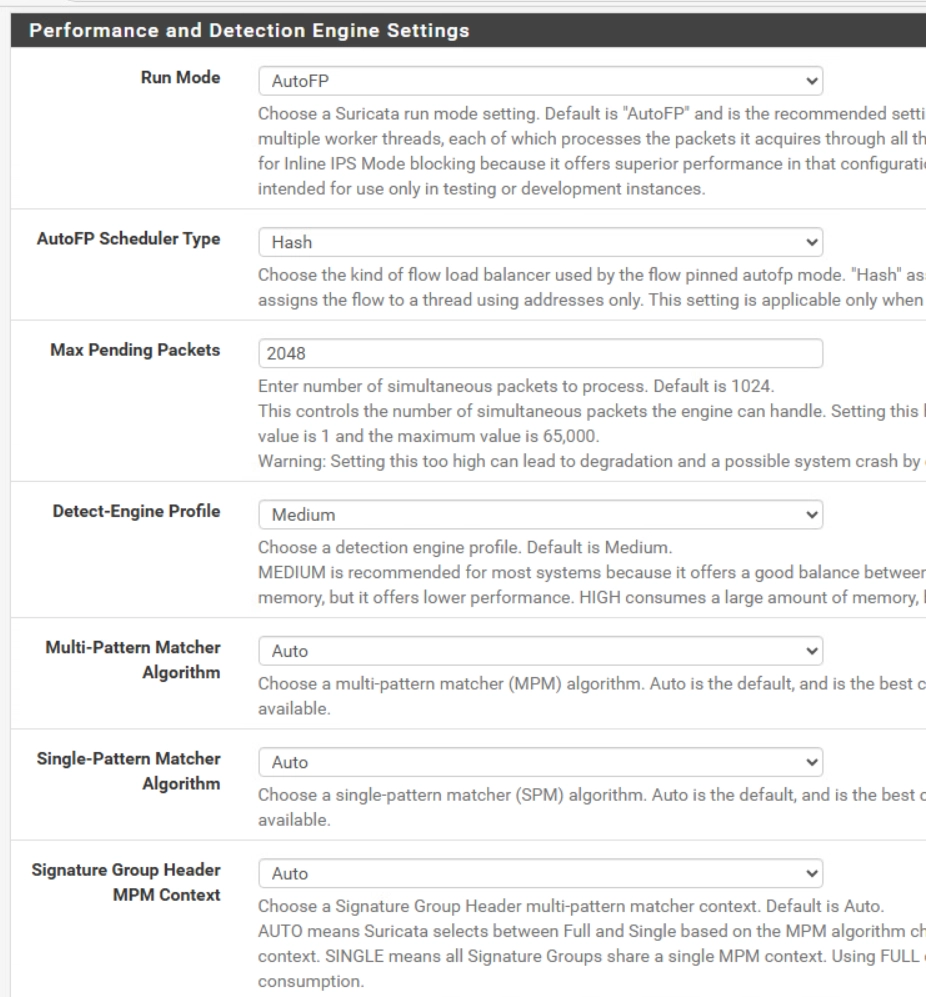

> offload 오류 발생시
    offload 관련 오류 발생 시
    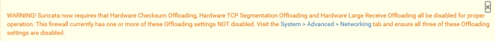
    System → Advanced
    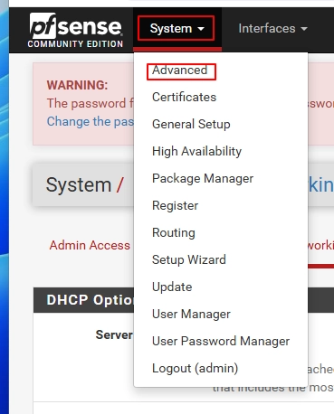
    Networking 클릭
    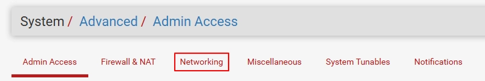
    하단 Network Interfaces에서 아래 offload 관련 항목 체크
    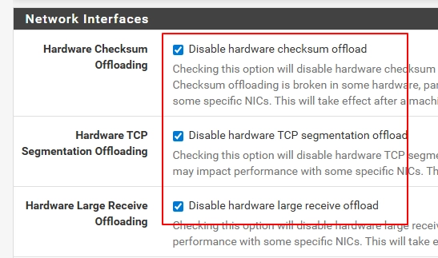
    재부팅
    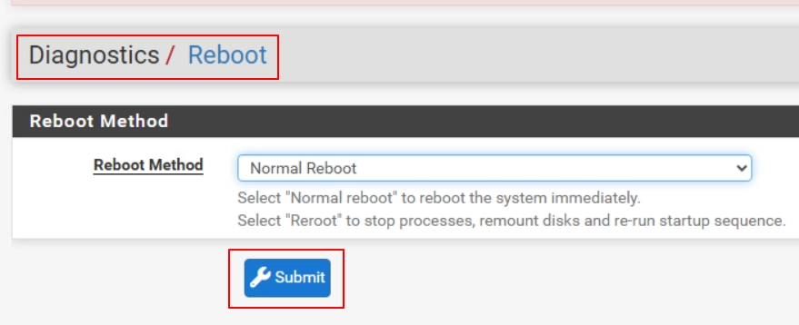

---

## 5. 주요 명령어 / 설정 치트시트
FreeBSD 기반 명령어
---

## 6. 실습 예시

**목표**: udp 플로딩 탐지 및 차단 점검

**환경**
- 192.168.0.56 / fpSense(wan 192.168.0.44 - lan 192.168.150.1) -> win7(192.168.150.131) / udp ddos 공격 실행 후 차단, 로그 확인

**Step 1 — 전체 open**
결과: udp 패킷이 win7 wireshark 에서 탐지됨

**Step 2 — 방화벽 설정**
결과: udp 패킷이 win7 wireshark 에서 탐지 되지 않음

---

## 7. 트러블슈팅

| 증상 | 원인 | 해결 방법 |
|------|------|-----------|
| ip 세팅 문제로 통신 실패 | ip 세팅 잘못됨 | https://blog.woohahaapps.com/269 |

---

## 8. 참고 자료
- [공식 문서](https://docs.netgate.com/pfsense/en/latest/config/?_gl=1*1k6cr9*_gcl_au*MTQyMDQyOTM5LjE3NzU3MDA4OTM.*_ga*MTQyNjgxMTk5NC4xNzc1NzAwODkz*_ga_TM99KBGXCB*czE3NzU3MjEwNTckbzMkZzEkdDE3NzU3MjEwNzYkajQxJGwwJGgxMzUyMTIxOTQ3)
- [GitHub](https://github.com/orgs/pfsense/repositories)
- [기타 참고 링크](https://blog.naver.com/laci/222014876621)

